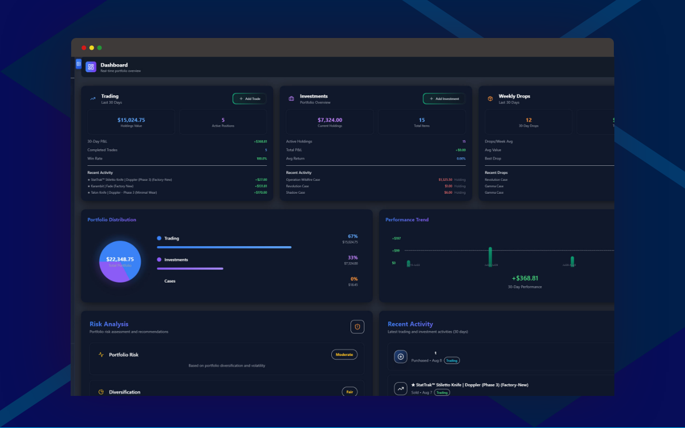
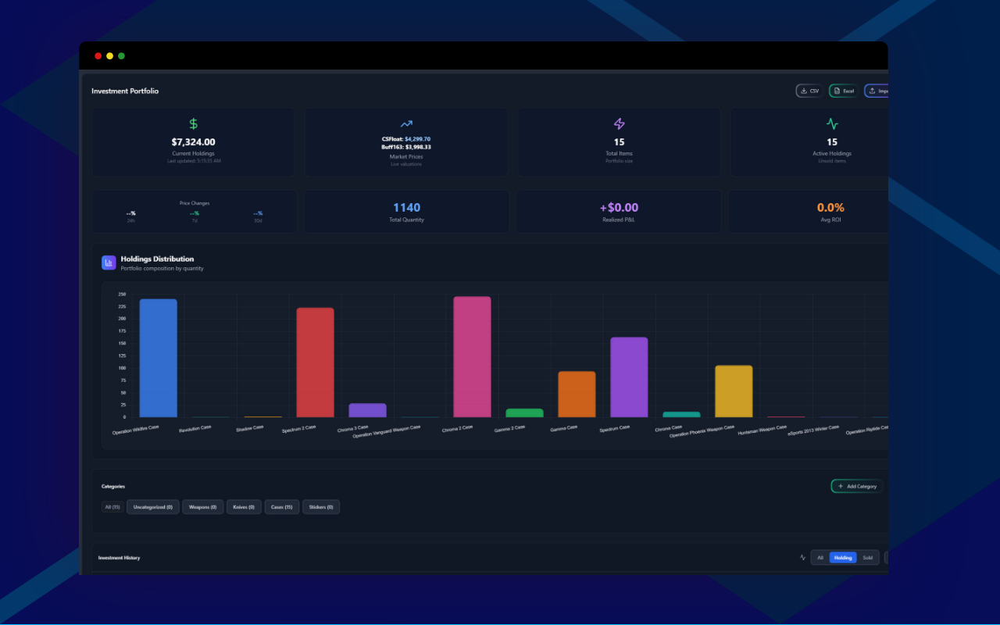

<div align="center">


# SkinStatz

**Your Skin Arsenal, Fully Tracked - Professional CS2 Trading Analytics Platform**

[](SkinStatz%20for%20chrome/)
[](SkinStatz%20for%20Firefox/)
[](https://github.com/Sadat41/SkinStatz)
[](LICENSE)
[](https://store.steampowered.com/app/730/CounterStrike_2/)

[Download](#installation) • [Features](#key-features) • [Documentation](#usage-guide) • [Development](#development-setup)

</div>

## Previews

<div align="center">
  
### Dashboard Overview


### Trading Management


### Investment Tracking


### Market Analysis


</div>

---

## Overview

SkinStatz is a comprehensive CS2 skin trading analytics platform that provides professional portfolio management and real-time market insights. Whether you're a casual trader or a serious investor, SkinStatz helps you track your trades, analyze market trends, and optimize your trading strategies.

### Key Features

- **Trading Management** - Track trades with advanced weekly and monthly analytics, graphs, and comprehensive data visualization
- **Investment Tracking** - Long-term investment monitoring with detailed analytics and performance metrics
- **Case Drop Analytics** - Weekly drop tracking with advanced analytics and statistical insights
- **Skin Explorer** - Comprehensive market browser supporting Steam and CSFloat with recent sales, listings, and in-depth analytics
- **Advanced Analytics** - Weekly, monthly, and yearly breakdowns with interactive charts and graphs
- **Real-time Pricing** - Live market data integration from CSFloat and Buff163 APIs
- **Cross-Browser Support** - Available for both Chrome and Firefox
- **Data Persistence** - Local storage with export/import functionality

---

## Tech Stack


**Frontend:** Vanilla JavaScript ES6+, TailwindCSS, Responsive Design  
**State Management:** Zustand with LocalStorage persistence  
**Charts & Visualization:** ApexCharts, Chart.js, D3.js  
**Architecture:** Browser Extension (Manifest V3), SPA with Page.js routing  
**APIs:** CSFloat Market API, Buff163 Price API, Steam Market Integration

---

## Installation

<div align="center">

### Download for Your Browser

<a href="SkinStatz for chrome/">
  
</a>
<a href="SkinStatz for Firefox/">
  
</a>

*Click the browser logo above to access the extension files*

</div>

---

### Chrome Installation

1. **Download** the repository and navigate to the `SkinStatz for chrome/` folder
2. **Open Chrome** and go to `chrome://extensions/`
3. **Enable** "Developer mode" (toggle in top right)
4. **Click** "Load unpacked" and select the `SkinStatz for chrome/` folder
5. **Done!** Click the SkinStatz icon in your browser toolbar to start

### Firefox Installation

1. **Download** the repository and navigate to the `SkinStatz for Firefox/` folder
2. **Open Firefox** and go to `about:debugging`
3. **Click** "This Firefox" in the sidebar
4. **Click** "Load Temporary Add-on" and select `manifest.json` from the `SkinStatz for Firefox/` folder
5. **Done!** Click the SkinStatz icon in your browser toolbar to start

<details>
<summary>Click to expand detailed installation guide</summary>

#### Step 1: Download the Extension
1. Go to the [GitHub repository](https://github.com/Sadat41/SkinStatz)
2. Click the green **"Code"** button → **"Download ZIP"**
3. Extract the ZIP file to a memorable location

#### Step 2: Enable Developer Mode (Chrome)
1. Open **Google Chrome**
2. Navigate to `chrome://extensions/` or:
   - Click three dots menu (⋮) → **More tools** → **Extensions**
3. Find **"Developer mode"** toggle in the top right corner
4. Click to **turn it ON** (should turn blue/green)

#### Step 3: Load the Extension
1. Click **"Load unpacked"** button (now visible)
2. Navigate to your extracted folder
3. Select the `SkinStatz for chrome/` folder
4. Click **"Select Folder"**

#### Step 4: Verify Installation
- Look for **"SkinStatz"** in your extensions list
- Status should show **"Enabled"**
- Click the SkinStatz icon in your toolbar to open the application

</details>

---

## Usage Guide

### Getting Started

1. **Install** the browser extension following the instructions above
2. **Click** the SkinStatz icon in your browser toolbar
3. **Start** by adding your first trade or investment

### Core Features

| Feature | Description |
|---------|-------------|
| **Dashboard** | Overview of your entire portfolio with key metrics and charts |
| **Trading** | Manage individual trades, track holdings, and analyze performance |
| **Investments** | Long-term investment tracking with category organization |
| **Cases** | Track weekly case drops and analyze opening patterns |
| **Skin Explorer** | Browse market data with Steam and CSFloat integration, view recent sales and listings with detailed analytics |

### Data Management

- **Export Data**: Download your complete trading history as Excel/CSV
- **Import Data**: Upload existing trading records from other platforms
- **Backup**: Regular automatic backups to prevent data loss
- **Sync**: Data persists across browser sessions

---

## Project Structure

```
SkinStatz/
├── SkinStatz for chrome/          # Chrome extension (Manifest V3)
│   ├── manifest.json              # Chrome extension manifest
│   ├── popup.html                 # Extension popup interface
│   ├── background.js              # Service worker
│   ├── icons/                     # Extension icons
│   └── src/                       # Application source code
├── SkinStatz for Firefox/         # Firefox extension (Manifest V2)
│   ├── manifest.json              # Firefox extension manifest
│   ├── popup.html                 # Extension popup interface
│   ├── background.js              # Background script
│   ├── icons/                     # Extension icons
│   └── src/                       # Application source code
├── Preview/                       # Application screenshots
│   ├── Dashboard.png
│   ├── Trading Overview.png
│   ├── investments.png
│   └── Skin Explorer.png
└── README.md                      # Documentation
```

### Source Code Structure

```
src/
├── pages/
│   ├── Dashboard/                 # Portfolio overview & metrics
│   ├── Trading/                   # Trade history & holdings
│   ├── Investments/               # Long-term investment tracking
│   ├── Cases/                     # Weekly drop tracking
│   ├── Profile/                   # User settings & stats
│   └── SkinExplorer/              # Market browser
├── components/                    # Reusable UI components
│   ├── Chart.js
│   ├── Modal.js
│   ├── TradingChart.js
│   └── WaterfallChart.js
├── services/                      # API integration
│   └── PriceService.js
├── utils/                         # Helper functions
│   ├── exportImport.js
│   ├── steamApi.js
│   └── csfloatUrls.js
├── main.js                        # Application entry point
├── router.js                      # SPA routing
└── store.js                       # State management
```

---

## Data Models

### Trade Record
```javascript
{
  id: string,
  itemName: string,
  buyPrice: number,
  sellPrice: number | null,
  quantity: number,
  date: string,
  sellDate: string | null,
  status: 'holding' | 'sold',
  profit: number | null,
  returnPercentage: number | null,
  category: string
}
```

### Investment Record
```javascript
{
  id: string,
  itemName: string,
  buyPrice: number,
  currentPrice: number,
  quantity: number,
  date: string,
  category: 'skin' | 'case' | 'sticker' | 'other',
  unrealizedPL: number,
  returnPercentage: number
}
```

### Case Drop Record
```javascript
{
  id: string,
  caseName: string,
  dropDate: string,
  price: number,
  account: string,
  weekId: string,
  year: number,
  month: number
}
```

---

## API Integration

Currently integrated with:

- **CSFloat API** - Real-time skin price data and market listings
- **Buff163 API** - Chinese market price comparisons and trends
- **Steam Market API** - Historical price data and market statistics (planned)

### Price Fetching

The application automatically fetches current market prices for your holdings, providing:
- Real-time portfolio valuation
- Profit/loss calculations
- Market trend analysis
- Price alerts and notifications

---

## Development Setup

### Prerequisites
- Node.js 16+ (for development tools)
- Chrome or Firefox browser
- Basic knowledge of JavaScript ES6+

### Local Development

```bash
# Clone the repository
git clone https://github.com/Sadat41/SkinStatz.git

# Navigate to project
cd SkinStatz

# For Chrome development
cd "SkinStatz for chrome"

# For Firefox development  
cd "SkinStatz for Firefox"

# Load in browser for testing
# Chrome: chrome://extensions/ → Developer mode → Load unpacked
# Firefox: about:debugging → Load Temporary Add-on
```

### Development Guidelines

- **Architecture**: Modular ES6+ with component-based structure
- **State Management**: Zustand for global state + LocalStorage persistence
- **Styling**: TailwindCSS utility-first with glassmorphism design
- **Code Style**: Modern JavaScript, async/await, comprehensive error handling
- **Responsive**: Mobile-first design with progressive enhancement

---

## Privacy & Security

### What This Extension Does
- **Local Data Only** - All data stored locally in browser storage
- **No Tracking** - No user analytics or behavior tracking
- **Secure APIs** - Only connects to trusted CS2 market APIs
- **Open Source** - Complete source code available for review

### Permissions Explained
```json
{
  "permissions": ["storage", "activeTab"],
  "host_permissions": ["https://csfloat.com/*", "https://buff.163.com/*"]
}
```

- **`storage`** - Save your trading data locally
- **`activeTab`** - Access current tab for market integration
- **Host permissions** - Connect to price APIs for real-time data

---

## Browser Compatibility

| Browser | Support | Notes |
|---------|---------|-------|
| **Chrome 88+** | Full | Recommended |
| **Firefox 78+** | Full | Available |
| **Edge (Chromium)** | Full | Compatible |
| **Brave** | Full | Tested |
| **Opera** | Partial | May work |
| **Safari** | No | Different extension system |

---

## Contributing

### Development Setup

```bash
# Fork the repository
git clone https://github.com/YOUR_USERNAME/SkinStatz.git

# Create a feature branch
git checkout -b feature/amazing-feature

# Make your changes and commit
git commit -m 'Add amazing feature'

# Push to your fork
git push origin feature/amazing-feature

# Open a Pull Request
```

### Guidelines

1. **Follow** existing code style and patterns
2. **Test** changes in both Chrome and Firefox
3. **Document** new features and API changes
4. **Ensure** no breaking changes to existing data structures

---

## Roadmap

### Completed Features
- Trading management with advanced weekly and monthly analytics
- Investment tracking with comprehensive analytics and performance metrics
- Case drop tracking with detailed weekly analytics and graphs
- Skin Explorer with Steam and CSFloat integration for recent sales and listings
- Advanced data visualization with interactive charts and graphs
- Real-time price integration from multiple APIs
- Cross-browser compatibility with Chrome and Firefox extensions
- Data export/import functionality

### In Development
- Advanced charting and technical indicators
- Mobile-responsive design improvements
- Enhanced notification system
- Portfolio optimization recommendations

### Planned Features
- **Profile Section** - User settings and preferences with multi-currency support
- **Enhanced Skin Explorer** - Buff163 integration for expanded market data
- **Steam Integration** - Steam sign-in option for seamless account connectivity
- **Advanced Analytics** - Extended market analysis and trend prediction
- **Multi-currency Support** - Support for various currencies in profile settings

---

## Support & Feedback

### Getting Help

- **Documentation**: Check this README for detailed guides
- **Issues**: [Report bugs or request features](https://github.com/Sadat41/SkinStatz/issues)
- **Discussions**: [Community discussions and questions](https://github.com/Sadat41/SkinStatz/discussions)

### Common Issues

<details>
<summary>Extension not loading?</summary>

**Solutions:**
- Ensure Developer Mode is enabled
- Check that manifest.json is in the selected folder
- Refresh the extensions page and try again
- Check browser console for error messages

</details>

<details>
<summary>Price data not updating?</summary>

**Fixes:**
- Check internet connection
- Verify API endpoints are accessible
- Clear browser cache and reload extension
- Check if CSFloat/Buff163 APIs are operational

</details>

---

## License

This project is licensed under the MIT License - see the [LICENSE](LICENSE) file for details.

---

## Changelog

### Version 2.0.0 (Latest)
- Complete UI/UX redesign with glassmorphism
- Enhanced portfolio analytics and charts
- Real-time price integration with multiple APIs
- Cross-browser extension support
- Advanced investment tracking features
- Comprehensive data export/import system

### Version 1.0.0
- Initial release with basic trading functionality
- Simple portfolio tracking
- Manual price entry system
- Local data storage

---

<div align="center">

**Made with ❤️ for the CS2 trading community**

[⭐ Star this repo](https://github.com/Sadat41/SkinStatz) • [🐛 Report Bug](https://github.com/Sadat41/SkinStatz/issues) • [💡 Request Feature](https://github.com/Sadat41/SkinStatz/issues)

---

*Transform your CS2 trading experience with professional analytics and insights*

</div>